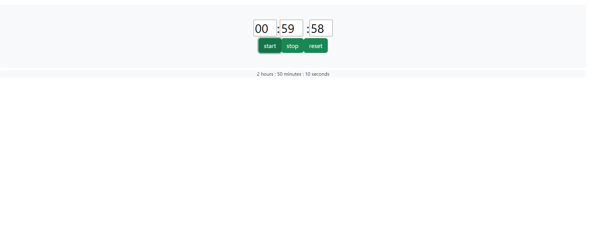

# StopWatch

## Description
This project is a countdown timer where users can input hours, minutes, and seconds,
and the program will initiate a countdown based on the provided time input. 

## Installation
* To set up the project, follow these steps:
  1. Open your terminal.
  2. Run `npm update`.
  3. Run `npm run build`
  4. Run `npm run watch`

## Usage
* Input desired hours, minutes, and seconds for the countdown
* Start the timer by pressing the "start" button

* Wait till the timer reaches 0
* press "reset" to enter in a new time
* press start again start the timer again
# Pics

## Documentation
### Controller Class
 [Controller Link](./src/js/README.md)

### Timer Class
[Timer Link](./dev_modules/@ocdla/Timer/README.md)